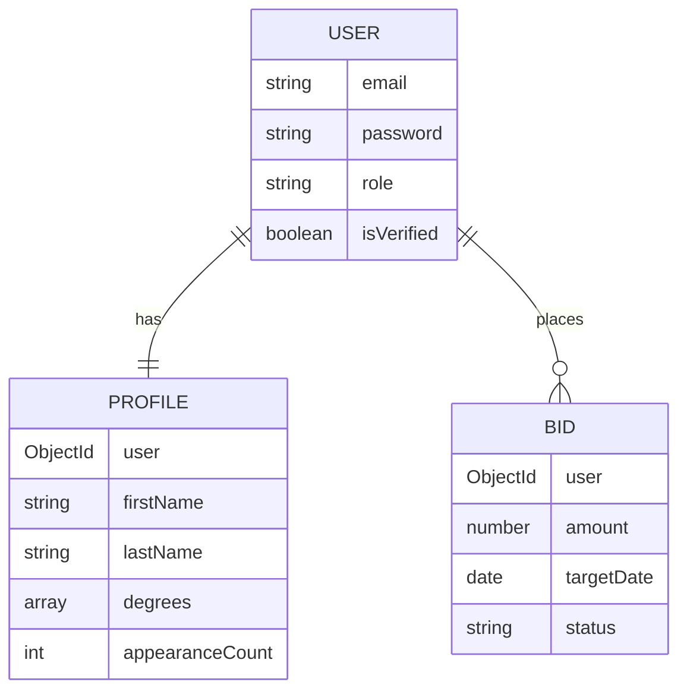

# Alumni Influencers Platform API

Rest API for the University of Eastminster Alumni Influencers Platform. Allows alumni to bid for "Featured Alumnus of the Day" slots for AR mobile clients.

## System Architecture

Follows the Model-View-Controller (MVC) pattern for clean separation of concerns:

- **src/models**: Mongoose schemas
- **src/controllers**: Logic for requests, bidding, and winner selection
- **src/routes**: API endpoint definitions
- **src/middleware**: Auth (JWT), validation (Joi), and sanitization
- **src/config**: DB and mailer configuration
- **src/utils**: Helpers (email, etc.)

## Security

- **Authentication**: JWT based sessions
- **RBAC**: Admin and Alumni roles
- **Validation**: Strict Joi schemas for all inputs
- **Sanitization**: Protection against NoSQL Injection and XSS
- **Protection**: Rate limiting and Helmet security headers

## Database Schema



## Setup

### 1. Installation
1. `npm install`
2. Create `.env` from `.env.example`

### 2. Run
```bash
# dev
npm run dev

# production
npm start
```

## API Documentation
Interactive Swagger UI available at: `http://localhost:3000/api-docs`

## Scripts
- **postman_collection.json**: Import into Postman for testing
- **seed_winner.js**: Populate test winner for today
- **test_selection.js**: Manually trigger bidding selection logic
